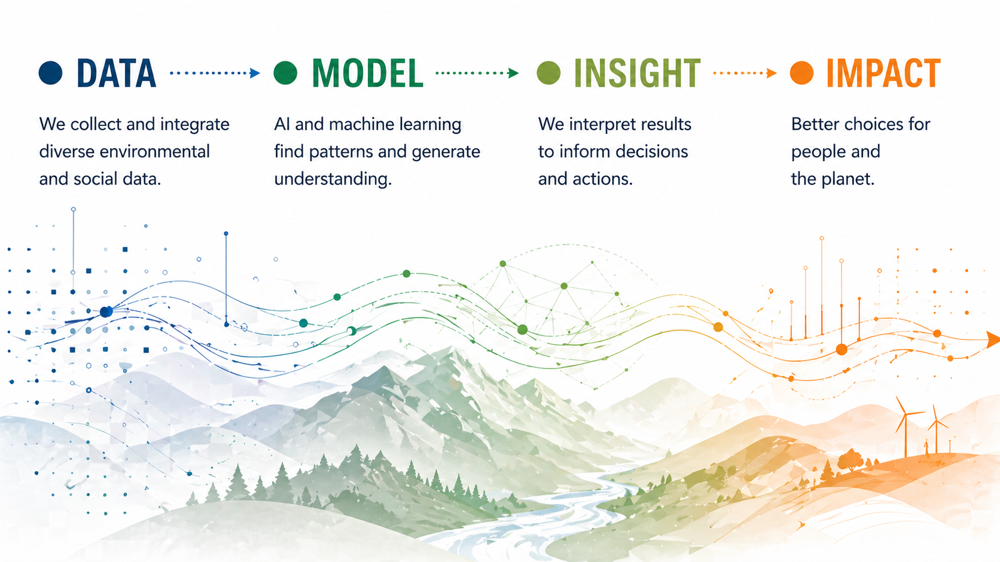

# Defining AI/ML

AI in environmental science spans remote sensing, prediction, simulation, and scientific workflows.

Artificial intelligence is increasingly embedded in how environmental science is conducted. In this working group, AI is not treated as a single technique but as a set of approaches for learning from data, representing complex processes, and supporting decisions under uncertainty. The aim is not to replace domain knowledge, but to extend what can be observed, modeled, and explored across space and time.

Machine learning is now widely used to extract structure from large environmental datasets and to model Earth system processes [@reichstein2019]. At the same time, purely data-driven approaches often fail in scientific settings without guidance from physical understanding, leading to the rise of hybrid methods that integrate models and data [@karpatne2017].

## How AI shows up in environmental work

### Perception: seeing structure in data

Pattern detection in imagery and sensor data, such as land cover, fire, species, or sensor observations.

**Image placeholder:** Add a visual example of perception, classification, detection, or segmentation.

Perception systems classify, detect, and segment patterns in images and time series. In environmental science, this includes land cover mapping, wildfire detection, species identification, and extracting features from satellite imagery.

### Prediction: forecasting system behavior

Forecasting change, risk, and fluxes across space and time.

**Image placeholder:** Add a forecast, map, plot, or risk surface that shows predictive use of AI.

Predictive models estimate future states such as drought risk, fire growth, or carbon flux. These systems rely on historical data and assumptions about how processes evolve, and they often struggle when conditions shift beyond the range of past observations.

### Generation: synthesizing outputs and scenarios

Producing summaries, scenarios, and structured outputs.

**Image placeholder:** Add an example of a generated summary, scenario, workflow aid, or structured output.

Generative systems create text, code, and sometimes synthetic data. In scientific contexts, they are most useful for documentation, exploration of scenarios, and accelerating workflows rather than as sources of ground truth.

## Hybrid and physical AI

Hybrid approaches combine machine learning with process-based models. These are central in Earth system science, where physical constraints, conservation laws, and known mechanisms shape system behavior. Theory-guided data science explicitly formalizes this integration [@karpatne2017].

## Agentic systems and workflows

A newer development is the emergence of systems that can plan and execute tasks: running analyses, calling tools, and iterating toward goals. These systems are beginning to reshape how scientific workflows are organized, especially in repository-driven environments.

## What is changing right now

AI is shifting toward multimodal and geospatial-native models that integrate imagery, time series, and text into shared representations of the Earth system. Foundation-model approaches train once on large datasets and adapt to many downstream tasks [@bommasani2021]. These advances enable transfer across regions and problems, but also introduce risks of hidden bias and overconfidence in generalization.

## Where AI struggles in environmental contexts

AI systems often fail when:

- observational data are incomplete or biased
- models are applied outside their training conditions
- objectives, or loss functions, do not reflect real-world goals
- spatial and temporal scales are mismatched
- uncertainty is poorly quantified, especially for rare or extreme events

These limitations are well documented in Earth system applications [@reichstein2019].

## What to take into the collaboration

AI is most effective when it is aligned with system structure, informed by domain expertise, and evaluated in terms that matter for decisions. Treat models as approximations shaped by data and objectives, not as representations of full system understanding.

## Examples from this working group

### Early data exploration

Add or replace initial plots, maps, and diagnostics that reveal structure and gaps in the data.

- Upload exploration images to `docs/assets/explorations/`.
- Link them here with Markdown image syntax.
- Caption each image with what it shows and why it matters.

### Outputs and synthesis

Add or replace figures, maps, and summaries used to communicate results.

- Upload final outputs to `docs/assets/figures/` or `docs/assets/files/`.
- Link them here with Markdown image or button syntax.
- Caption each output with the claim or decision it supports.

## Working prompt

As a group, define what counts as data, what the model represents, what success means, and where uncertainty enters.

{{ references }}
