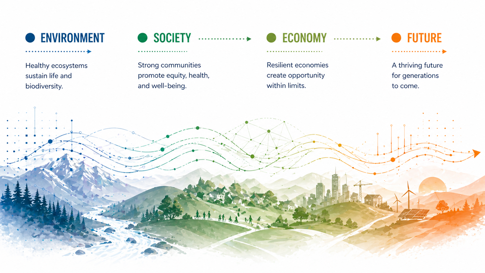

# Defining Sustainability

Environmental systems are coupled with human decisions across space and time.

Sustainability science studies how environmental and human systems interact over time, with the goal of maintaining system function, resilience, and equity under changing conditions. It is a use-inspired, problem-driven field focused on real-world outcomes rather than abstract optimization [@kates2001].

Environmental systems are not isolated. They are coupled with human behavior, policy, and economic activity, forming integrated systems that evolve together [@liu2007]. These systems operate across multiple scales and are increasingly shaped by global change.

## The questions that matter

Sustainability scientists focus on questions such as:

- How do systems respond to disturbance, such as fire, drought, or land use change?
- Where are the limits of resilience and stability?
- How do processes scale from local observations to regional or global dynamics?
- How do we manage tradeoffs among competing outcomes?
- How do systems behave under nonstationary conditions, such as climate change?

These are not purely predictive problems. They involve interpretation, competing objectives, and decisions under uncertainty.

## How these systems behave

### Interconnected systems and feedbacks

Feedbacks, thresholds, and nonlinear interactions are common.

**Image placeholder:** Add a conceptual diagram, sketch, or example that shows feedbacks, thresholds, or nonlinear interactions.

Environmental systems exhibit feedback loops, thresholds, and tipping points. Small changes can produce large effects, and system behavior is often nonlinear.

### Scale

Processes operate across spatial and temporal scales. A model that performs well at one scale may fail at another. Scaling is not only computational; it is ecological and physical.

### Nonstationarity

The assumption that the future resembles the past is often invalid. Climate change and other disturbances are shifting baseline conditions, making historical data an imperfect guide [@ipcc2023].

### Coupled human-natural systems

Human actions are embedded in environmental systems. Land use, management, and policy decisions interact with ecological processes, meaning there is no clean separation between inputs and outcomes [@liu2007].

### Limits and thresholds

At planetary scales, systems exhibit boundaries and constraints that shape what is possible [@rockstrom2009].

## Where AI needs to adapt

When applied to sustainability problems, AI systems must:

- treat data as partial and biased observations
- handle changing distributions over time
- respect scale-dependent behavior
- align models with meaningful, often competing objectives
- support interpretation and decision-making, not just prediction

## Where sustainability needs AI

AI can extend sustainability science by:

- scaling analysis across large, heterogeneous datasets
- detecting patterns that are difficult to observe directly
- accelerating simulation and modeling
- supporting scenario exploration and synthesis

## Examples from this working group

### Exploration and field context

Add or replace concept sketches, field notes, and early framing of system behavior.

- Upload whiteboard or context images to `docs/assets/whiteboards/`.
- Link them here with Markdown image syntax.
- Caption each image with what it clarifies about the system.

### Deliverables and reports

Add or replace reports, figures, and outputs used for communication and decision support.

- Upload final reports, slides, or briefs to `docs/assets/files/`.
- Upload final figures to `docs/assets/figures/`.
- Link each item here with a short explanation of who should use it.

## Working prompt

As a group, define what counts as data, what the model represents, what success means, and where uncertainty enters.

## Key references

These references anchor the concepts above without requiring exhaustive reading.

{{ references }}
