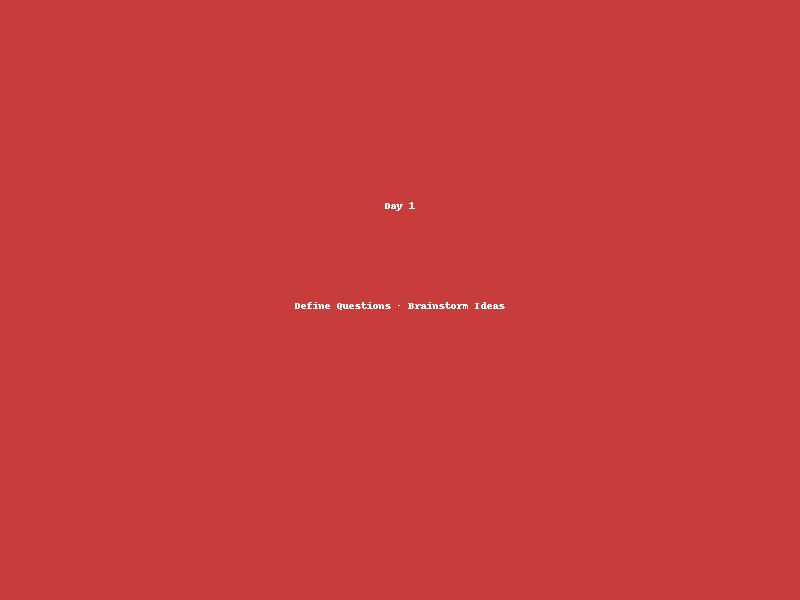
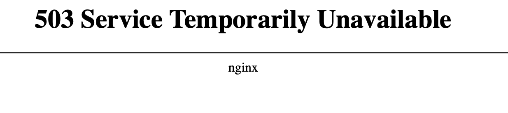
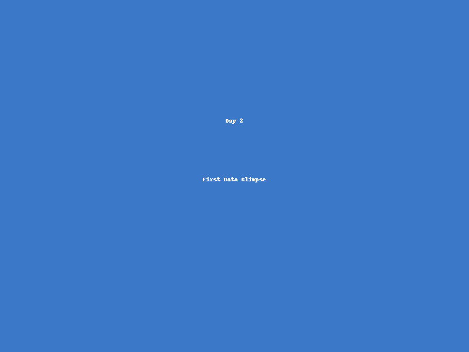
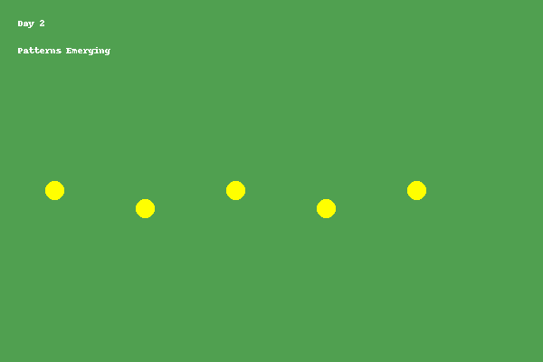
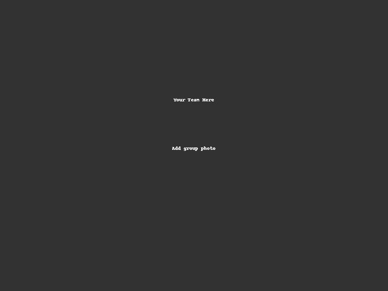
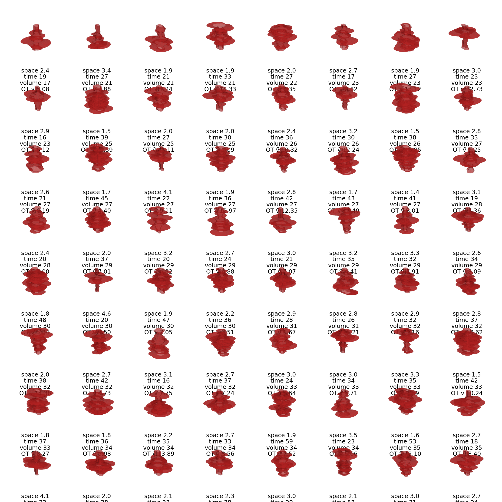
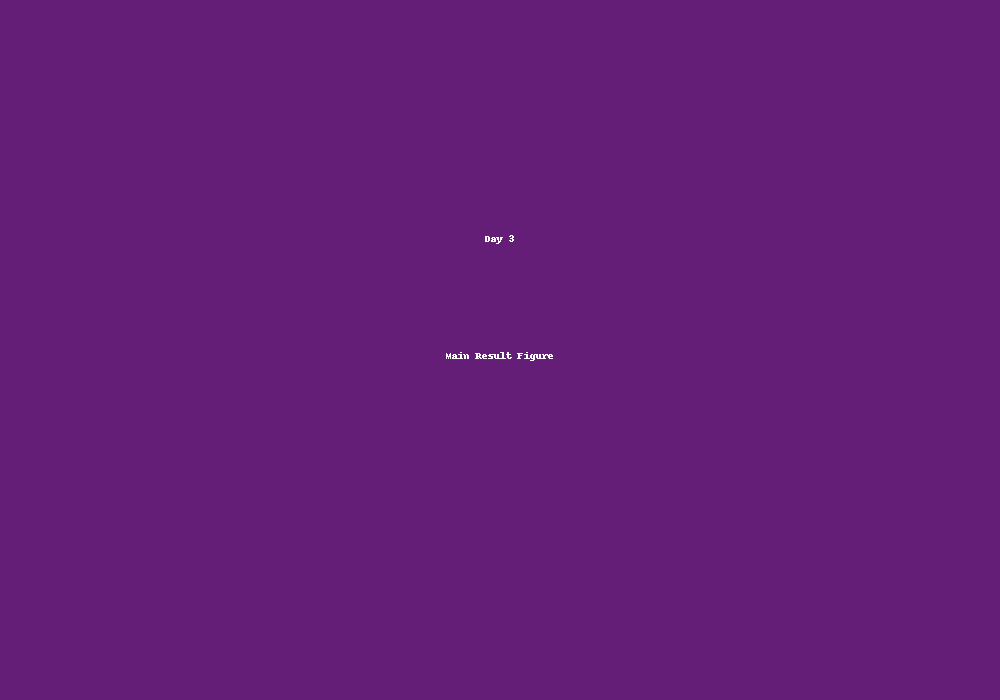

# Project Title 

<a href="https://github.com/CU-ESIIL/Project_group_OASIS/edit/main/docs/index.md" title="Edit this page">✏️</a>

<!-- =========================================================
HERO (Swap hero.jpg, title, strapline, and the three links)
========================================================= -->

[Raw photo location: hero.jpg](https://github.com/CU-ESIIL/Project_group_OASIS/blob/main/docs/assets/hero.jpg)

**One sentence on impact:** In 3 days, we explore *X* to inform *Y*, producing actionable visuals, a concise brief, and shareable code.

**[Project brief (PDF)](#) · [View shared code](https://github.com/CU-ESIIL/Project_group_OASIS/tree/main/code) · [Data & access](data.md)**

> **About this site:** This is a public, in-progress record of a 3-day project at the Innovation Summit. Edit everything here in your browser: open a file → pencil icon → Commit changes.

---

## How to use this page (for the team)
- **Edit this file:** `docs/index.md` → ✎ → change text → **Commit changes**.
- **Add images:** upload to `docs/assets/` and reference like `assets/your_file.png`.
- Keep **text short** and **visuals first**. Think “slide captions,” not essays.

**Quality check:** A useful project page states what changed, shows the artifact that supports it, and names what remains uncertain. Write claims, not activity logs. Avoid generic phrases like “we explored,” “we discussed,” or “more work is needed” unless you explain exactly what was explored, decided, or unresolved.

---

## Day 1 — Define & Explore
*Focus: questions, hypotheses, context; add at least one visual (photo of whiteboard/notes).*

### Our product 📣
- **Product:** 1 sentence naming the tangible output you want to create.
- **Primary user:** Who should be able to use it?
- **Done enough means:** What must be true by the end of the sprint?

### Our question(s) 📣
<!-- EDIT: Replace bullets with 2-4 specific, testable questions. -->
- Question 1 — What specific pattern, relationship, decision, or workflow are we trying to understand or change?
- Question 2 — Where, when, or for whom does this question matter?
- Question 3 — What would count as useful evidence by Day 3?

### Hypotheses / intentions [Optional: probably not relevant if you are creating an educational tool]
<!-- EDIT: Plain language, short and honest; 3 max. -->
- We think that …
- We intend to test whether …
- We will know we’re onto something if …

### Why this matters (the “upshot”) 📣
<!-- EDIT: 2–3 sentences max, decision-oriented. -->
In 1-2 sentences, explain who is impacted and how this could change a decision, assumption, workflow, or scientific understanding.

### Inspirations (papers, datasets, tools)
<!-- EDIT: Swap in your own links. -->
- Publication: [Influential paper title](https://doi.org/xxxx)
- Dataset portal: [Example data hub](https://example.org)
- Tool/tech: [Method or library](https://example.org)

### Field notes / visuals
<!-- EDIT: Replace with a real smartphone photo or sketch; keep filename simple. -->

[Raw photo location: day1_whiteboard.jpg](https://github.com/CU-ESIIL/Project_group_OASIS/blob/main/docs/assets/day1_whiteboard.jpg)
*Caption: State what this artifact shows and which question, assumption, or disagreement it helped clarify.*

> **Different perspectives:** In 1-3 bullets, capture disagreements or alternate framings. Name the decision or uncertainty each one affects.

---

## Day 2 — Data & Methods
*Focus: what we’re testing and building; show a first visual (plot/map/screenshot/GIF).*

### Data sources we’re exploring 📣
<!-- EDIT: Link each source; add size/notes if relevant. -->
- **Source A:** Link to the source, name the coverage or scale, and say what question it could support.

  
[Raw photo location: explore_data_plot.png](https://github.com/CU-ESIIL/Project_group_OASIS/blob/main/docs/assets/explore_data_plot.png)
  *Snapshot: State the initial pattern, data gap, or quality issue this reveals.*

- **Source B:** Link and 1-line note on what it adds or why it may not work.

### Methods / technologies we’re testing 📣
<!-- EDIT: 2-4 max. Include what each method will produce. -->
- Approach 1 — what it tests or produces.
- Approach 2 — what it tests or produces.
- Visualization — what someone should be able to see or compare.

### Challenges identified
<!-- EDIT: Be specific; these are useful, not embarrassing. -->
- Data gap or quality issue — why it matters.
- Method limitation or compute constraint — how it affects interpretation.
- Decision still needed — who needs to decide and by when.

### Visuals
<!-- EDIT: Swap examples; keep file sizes modest. -->
#### Static figure

[Raw photo location: figure1.png](https://github.com/CU-ESIIL/Project_group_OASIS/blob/main/docs/assets/figure1.png)
*Figure 1.* State what this suggests and which question or claim it may support.

#### Animated change (GIF)

[Raw photo location: change.gif](https://github.com/CU-ESIIL/Project_group_OASIS/blob/main/docs/assets/change.gif)
*Figure 2.* State what changes across time and what uncertainty remains.

#### Interactive map (iframe)
<iframe
  title="Study area (OpenStreetMap)"
  src="https://www.openstreetmap.org/export/embed.html?bbox=-105.35%2C39.90%2C-105.10%2C40.10&layer=mapnik&marker=40.000%2C-105.225"
  width="100%" height="360" frameborder="0"></iframe>

<a href="https://www.openstreetmap.org/?mlat=40.000&mlon=-105.225#map=12/40.0000/-105.2250">Open full map</a>

> If an embed doesn’t load, put the normal link directly under it.

---

## Final Share Out — Insights & Sharing 
*Focus: synthesis. Turn your group’s work into a small number of clear, evidence-backed insights that another person could reuse. Practice a 2-minute walkthrough of the homepage 📣: Why → Questions → Data/Methods → Insights → Limits → Next.*

[Raw photo location: team_photo.jpg](https://github.com/CU-ESIIL/Project_group_OASIS/blob/main/docs/assets/team_photo.jpg)

### One-sentence takeaway 📣
<!-- EDIT: If someone only reads one line from this page, what should they learn? -->
> Replace this with one specific sentence that states the core result, product, or lesson.

### Core insights 📣
<!-- EDIT: Add 3-5 insights. Each insight must make a claim and point to evidence. Avoid "we discussed" or "we explored." -->

#### Insight 1 — [short declarative title]
- **What we found:** 1-2 specific sentences. State the claim, pattern, product, or lesson.
- **Why it matters:** What assumption, decision, workflow, or scientific question does this affect?
- **Evidence / artifact:** Link to a figure, gallery, notebook, PDF, dashboard, data product, or raw output.
- **Confidence:** High / Medium / Low — briefly explain why.

#### Insight 2 — [short declarative title]
- **What we found:**
- **Why it matters:**
- **Evidence / artifact:**
- **Confidence:**

#### Insight 3 — [short declarative title]
- **What we found:**
- **Why it matters:**
- **Evidence / artifact:**
- **Confidence:**

### Visuals that tell the story 📣
<!-- EDIT: Highlight 2-3 visuals that make the share-out understandable without a long explanation. -->

[Raw photo location: fire_hull.png](https://github.com/CU-ESIIL/Project_group_OASIS/blob/main/docs/assets/fire_hull.png)
*Caption:* State what this visual shows and which insight or claim it supports.

[Raw photo location: hull_panels.png](https://github.com/CU-ESIIL/Project_group_OASIS/blob/main/docs/assets/hull_panels.png)
*Caption:* State what this visual adds, compares, or documents. If it shows a failed attempt, say what failed and why that matters.

[Raw photo location: main_result.png](https://github.com/CU-ESIIL/Project_group_OASIS/blob/main/docs/assets/main_result.png)
*Caption:* State whether this is supporting evidence, a limitation, a workflow output, or a next-step prototype.

<iframe
  title="Short explainer video (optional)"
  width="100%" height="360"
  src="https://www.youtube.com/embed/ASTGFZ0d6Ps"
  frameborder="0" allow="accelerometer; autoplay; clipboard-write; encrypted-media; gyroscope; picture-in-picture; web-share"
  allowfullscreen></iframe>

### Surprises, failures, and limitations 📣
<!-- EDIT: Briefly list what did not work, what changed your thinking, or what remains uncertain. -->
- Surprise or failure 1 — why it matters.
- Surprise or failure 2 — why it matters.
- Limitation — what someone should not overclaim from this work.

### Reusable outputs 📣
<!-- EDIT: List anything another group could directly reuse. Link artifacts when possible. -->
- Code / notebook:
- Dataset / derived data product:
- Figure / visualization:
- Brief / slides / PDF:
- Workflow or method:

### What’s next? 📣
- Immediate follow-up:
- What we would do with one more week:
- What we would do with one more month:
- Who should see this next:

---

## Featured links (image buttons)
<!-- EDIT: Replace images/links; keep alt text meaningful and motion subtle. -->
<table>
<tr>
<td align="center" width="33%">
  <a href="assets/Seven%20ways%20to%20measure%20fire%20polygon%20velocity-4.pdf"> <strong>Read the brief</strong></a>
</td>
<td align="center" width="33%">
  <a href="https://github.com/CU-ESIIL/Project_group_OASIS/blob/main/code/fired_time_hull_panel.ipynb"> <strong>View code</strong></a>
</td>
<td align="center" width="33%">
  <a href="https://github.com/CU-ESIIL/Project_group_OASIS/blob/main/code/single_hull_demo.py"> <strong>Explore data</strong></a>
</td>
</tr>
</table>

---

## Team
| Name | Role | Contact | GitHub |
|------|------|---------|--------|
| Jane Doe | Lead | jane.doe@example.org | @janedoe |
| John Smith | Analyst | john.smith@example.org | @jsmith |

---

## Storage

Code
Keep shared scripts, notebooks, and utilities in the [`code/`](https://github.com/CU-ESIIL/Project_group_OASIS/tree/main/code) directory. Document how to run them in a README or within the files so teammates and visitors can reproduce your workflow.

Documentation
Use the [`docs/`](https://github.com/CU-ESIIL/Project_group_OASIS/tree/main/docs) folder to publish project updates on this site. Longer internal notes can live in [`documentation/`](https://github.com/CU-ESIIL/Project_group_OASIS/tree/main/documentation); summarize key takeaways here so the public story stays current.

---

## Cite & reuse
If you use these materials, please cite:

> Lastname, A., Lastname, B. (2025). *Project title*. DOI or URL.

License: CC-BY-4.0 unless noted. See dataset licenses on the **[Data](data.md)** page.

---

<!-- EDIT HINTS
- Upload images to docs/assets/ and reference as assets/filename.png
- Keep images ~1200 px wide; avoid >5–8 MB per file.
- Use short, active sentences; this is a scrolling “slide deck.”
- Update this page at least once per day during the sprint.
- Final Share Out entries should make claims, link evidence, state confidence, name limitations, and point to reusable outputs.
-->

## Site Health

--8<-- "_site_health.md"
