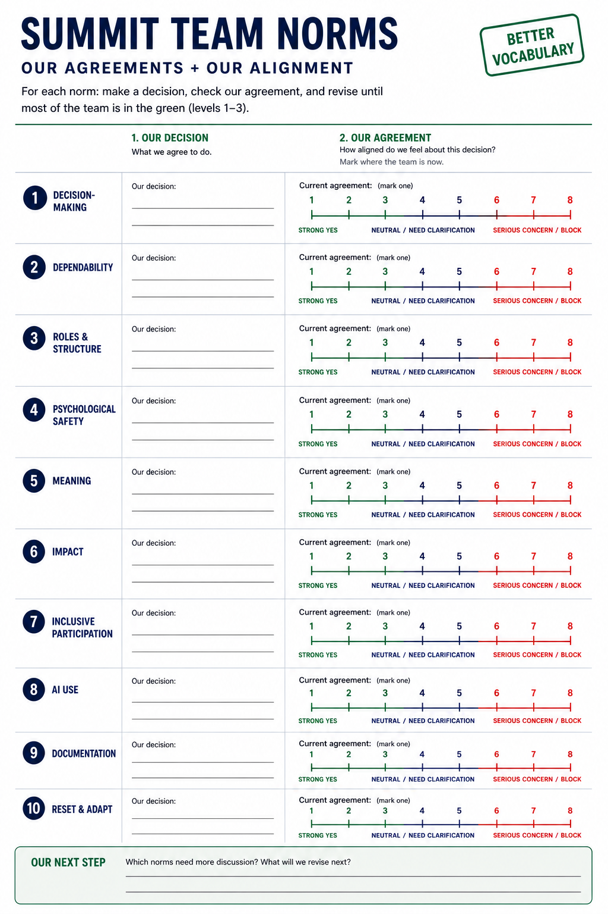

!!! tip "How to use this page during the summit"
    This page is your team’s shared workspace and final report-out page. 
    
    The agenda gives teams limited time, so use the page differently each day: 
    Day 1 is for alignment, Day 2 is for building one useful thing, and Day 3 is for synthesis and report out. Keep the page simple, current, and readable.
    
    Look for the green buttons to indicate what you need to edit. 
    
    Megaphones 📣 indicate which item you wil be presenting during the end-of-day report-outs.

    Only the items with megaphones will be visible when you hit the 'Summit Report Out' button. 

    If you turn of 'Instructions' then you will only see the page content for public display. 
    

# Team Home: Make Me Your Own

!!! note "Day 1 directions"
    Change the title to the name of your project.

    [Edit Day 1 setup in Markdown](https://github.com/CU-ESIIL/Project_group_OASIS/edit/main/docs/index.md?plain=1#L12){ .md-button target="_blank" rel="noopener" }

!!! tip "For ESIIL staff"
    Group Number: 1
    
    Breakout Room #: (To be assigned by ESIIL Staff)

    [ESIIL staff edit in Markdown](https://github.com/CU-ESIIL/Project_group_OASIS/edit/main/docs/index.md?plain=1#L11){ .md-button target="_blank" rel="noopener" }
    

{ .oasis-report-out-hero }

!!! note "How to replace the hero image"
    Upload your own image to `docs/assets/hero/` and replace the file named `hero.png`. Use a wide image if you can, then refresh the site preview to check how it looks.
    Keep the file path `docs/assets/hero/hero.png` if you want the Markdown above to keep working.

    [Open the hero image folder](https://github.com/CU-ESIIL/Project_group_OASIS/tree/main/docs/assets/hero){ .md-button target="_blank" rel="noopener" }

Use this page as your team’s working record during the summit and your final report-out page on Day 3.

### This page becomes your Summit Report Out

This page captures your group’s process and thinking throughout the Summit and will be used to share your work with others.

[See a completed example](example.md){ .md-button }

## People { #people }

!!! note "Day 1 task"
    Get to know your team: share your cards (5-7 mins). Update your team roster (2-3 min)

    Use the in-person name cards to guide quick introductions.

    | Name card prompts | Follow-up notes |
    |---|---|
    |  |  |

    [Edit People in Markdown](https://github.com/CU-ESIIL/Project_group_OASIS/edit/main/docs/index.md?plain=1#L37){ .md-button target="_blank" rel="noopener" }

| Name | Affiliation | Contact | Github |
|---|---|---|---|
| | | | |
| | | | |

## Team Norms and Decision Making { #team-norms-and-decision-making }

!!! note "Day 1 task"
       Suggested Self-Facilitation Instructions:
        - Round Robin: Everyone shares 1 norm that they think will be important for their team during the summit and perhaps following the summit (2 min).
        - After everyone has shared, make a list with as many norms as possible in GitHub (5-7 min).
        - Vote on your top 3 ideas. (Each person gets 3 votes; you can use all your votes on 1 idea or spread them out) (2 min).
        - In GitHub, move all team norms with votes to the top of the list.

    | Gradients of agreement | Summit team norms worksheet |
    |---|---|
    |  |  |

    [Edit Team Norms in Markdown](https://github.com/CU-ESIIL/Project_group_OASIS/edit/main/docs/index.md?plain=1#L54){ .md-button target="_blank" rel="noopener" }

Our team norms:

- ...
- ...
- ...

Our decision rule:

...

## Our product(s) 📣 { #product-direction .oasis-report-out-section }

!!! note "Day 2 Morning Task"
    Day 2 morning: use this section to define what the team is trying to understand, name early hypotheses or hunches, and add context. Include at least one visual, such as a photo of a whiteboard or notes.

    [Edit Our product(s) in Markdown 📣](https://github.com/CU-ESIIL/Project_group_OASIS/edit/main/docs/index.md?plain=1#L80){ .md-button target="_blank" rel="noopener" }

Our team is trying to understand or test:

...

Our working hypotheses or hunches:

- ...
- ...

Context people need to understand our work:

...

*Morning whiteboard or notes showing the question, hypotheses, and context we used to start Day 2.*

Our primary output type is:

- [ ] Figure or map
- [ ] Prototype or workflow
- [ ] Concept brief
- [ ] Decision framework
- [ ] Notebook or code example
- [ ] Research question and next-step plan

What we plan to test:

- ...
- ...

## Our question(s) 📣 { #project-question .oasis-report-out-section }

!!! note "Day 2 Morning Task"
    Day 2 morning: draft the project question, then spend no more than 10-15 minutes refining it so it matches what the team can realistically do.

    [Edit Our question(s) in Markdown 📣](https://github.com/CU-ESIIL/Project_group_OASIS/edit/main/docs/index.md?plain=1#L118){ .md-button target="_blank" rel="noopener" }

Our working question:

...

What would count as progress:

...

## Why this matters (the “upshot”) 📣 { #why-this-matters .oasis-report-out-section }

!!! note "Day 3 Task"
    Add the plain-language upshot. Keep this short: why the work matters, who could use it, and what changes if the team is right.

    [Edit Why this matters in Markdown 📣](https://github.com/CU-ESIIL/Project_group_OASIS/edit/main/docs/index.md?plain=1#L133){ .md-button target="_blank" rel="noopener" }

This matters because:

...

People who could use this:

...

## Data sources we’re exploring 📣 { #data-exploration .oasis-report-out-section }

!!! note "Day 2 Afternoon Task"
    Day 2 afternoon: try a few datasets and analyses. Replace the snapshot below with a visual showing initial data patterns. Add 2-4 promising data sources with links and 1-line notes. Keep this public-facing: what the source is, why it matters, and what it might help the team test.

    [Edit Data sources in Markdown 📣](https://github.com/CU-ESIIL/Project_group_OASIS/edit/main/docs/index.md?plain=1#L148){ .md-button target="_blank" rel="noopener" }

*Snapshot showing initial data patterns.*

Promising data sources:

- [Data source 1](#): ...
- [Data source 2](#): ...
- [Data source 3](#): ...
- [Data source 4](#): ...

## Methods/technologies we’re testing 📣 { #methods-and-code .oasis-report-out-section }

!!! note "Day 2 Afternoon Task"
    Day 2 afternoon: add 2-4 methods or technologies you're testing, such as stats, models, or visualization. Then add challenges identified, visuals, and short- and long-term next steps.

    [Edit Methods/technologies in Markdown 📣](https://github.com/CU-ESIIL/Project_group_OASIS/edit/main/docs/index.md?plain=1#L166){ .md-button target="_blank" rel="noopener" }

[View shared code](https://github.com/CU-ESIIL/Project_group_OASIS/tree/main/code){ .md-button }

Methods/technologies we are testing:

| Method or technology | What we tested | Early note |
|---|---|---|
| ... | ... | ... |
| ... | ... | ... |
| ... | ... | ... |
| ... | ... | ... |

### Challenges identified

- ...
- ...

### Visuals

### Testing notes

- ...
- ...

## Results { #results }

!!! note "Day 3 Task"
    Focus on synthesis. Highlight 2-3 visuals that tell the story and keep text crisp. Practice a 6-minute walkthrough of the homepage: Why → Questions → Data/Methods → Findings → Next.

    [Edit Results in Markdown](https://github.com/CU-ESIIL/Project_group_OASIS/edit/main/docs/index.md?plain=1#L203){ .md-button target="_blank" rel="noopener" }

*Lead result visual for the story.*

## Team Photo { #team-photo }

!!! note "Day 3 Task"
    Add a team photo or working-session photo. This helps the report-out page feel connected to the people who made the work.

    [Edit Team Photo in Markdown](https://github.com/CU-ESIIL/Project_group_OASIS/edit/main/docs/index.md?plain=1#L214){ .md-button target="_blank" rel="noopener" }

*Team members and collaborators who contributed to this project.*

## Findings at a glance 📣 { #findings-at-a-glance .oasis-report-out-section }

!!! note "Day 3 Task"
    Add three crisp headlines. Each one should make a public-facing claim: what happened, where it happened, how much it changed, or why it matters.

    [Edit Findings at a glance in Markdown 📣](https://github.com/CU-ESIIL/Project_group_OASIS/edit/main/docs/index.md?plain=1#L225){ .md-button target="_blank" rel="noopener" }

Headline 1 — what, where, how much

...

Headline 2 — change/trend/contrast

...

Headline 3 — implication for practice or policy

...

## Visuals that tell a story 📣 { #story-visuals .oasis-report-out-section }

!!! note "Day 3 Task"
    Choose 2-3 visuals that tell the story. These can be maps, figures, screenshots, diagrams, sketches, or annotated photos. Keep captions short and claim-oriented.

    [Edit Story Visuals in Markdown 📣](https://github.com/CU-ESIIL/Project_group_OASIS/edit/main/docs/index.md?plain=1#L244){ .md-button target="_blank" rel="noopener" }

*Visual 1: the main pattern or output we want people to remember.*

## What’s next? 📣 { #whats-next .oasis-report-out-section }

!!! note "Day 3 Task"
    Add immediate follow-ups, what the team would do with one more week or month, and who should see this next. Keep this specific enough that someone could continue the work.

    [Edit What's next in Markdown 📣](https://github.com/CU-ESIIL/Project_group_OASIS/edit/main/docs/index.md?plain=1#L255){ .md-button target="_blank" rel="noopener" }

Short term:

- ...

Long term:

- ...

Who should see this next

- ...

## Day 2 Report Out (2 minutes) { #report-out-day2 }

Use the `Summit Report Out` button to present the megaphone sections from this page. On Day 2, focus on your early framing:

- what you are making
- your main question
- why it matters
- promising datasets
- methods you are testing
- early observations or challenges

## Day 3 Report Out (6 minutes) { #report-out-day3 }

Use the same megaphone sections, but now present the more complete version of the story:

- your refined product
- your refined question
- key findings
- visuals that tell the story
- what comes next

## Polished Outputs { #polished-outputs }

!!! note "Day 3 Task"
    Add only the strongest outputs someone should look at after the summit. Aim for 1–2 strong visuals or artifacts, not a long collection of everything the team made.

    [Edit Polished Outputs in Markdown](https://github.com/CU-ESIIL/Project_group_OASIS/edit/main/docs/index.md?plain=1#L295){ .md-button target="_blank" rel="noopener" }

[Read the project brief PDF](assets/files/project_brief.pdf){ .md-button .md-button--primary }

{ .oasis-report-out-banner }

## Cite & Reuse

!!! note "Day 3 Task"
    Add links, data sources, software credits, citations, licenses, and next steps. Make it easy for someone to reuse or continue the work after the summit.

    [Edit Cite & Reuse in Markdown](https://github.com/CU-ESIIL/Project_group_OASIS/edit/main/docs/index.md?plain=1#L306){ .md-button target="_blank" rel="noopener" }

{{ references }}
