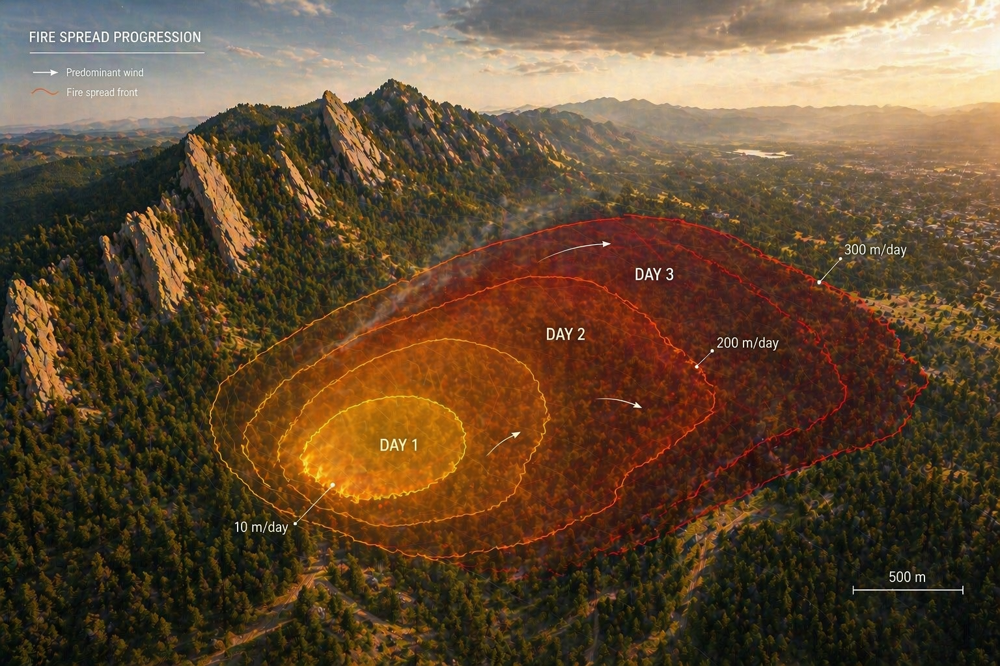
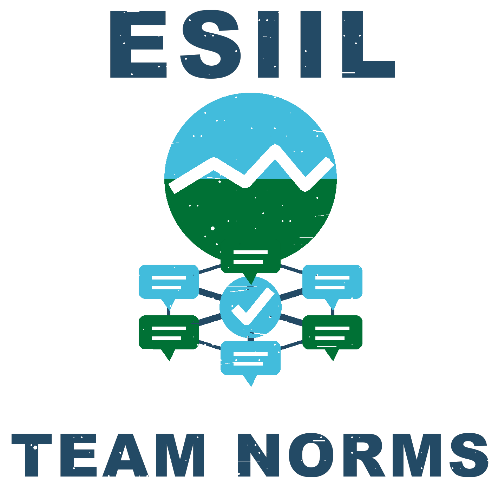
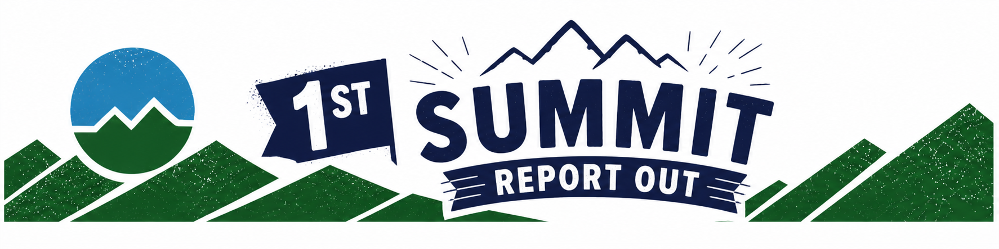
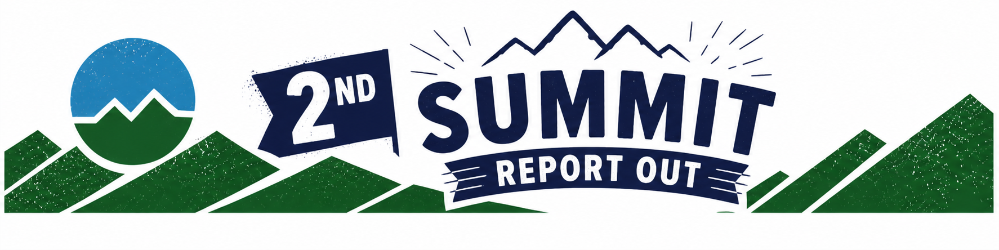

# Team Home: Make Me Your Own

!!! note "Day 1 directions"
    Change the title to the name of your project.

    [📣 Edit Day 1 setup in Markdown](https://github.com/CU-ESIIL/Project_group_OASIS/edit/main/docs/index.md?plain=1#L6){ .md-button target="_blank" rel="noopener" }

Breakout Room #: (To be assigned by ESIIL Staff)

*Replace this hero image with your team’s own image. Keep the file path `docs/assets/hero/hero.png` if you want the Markdown above to keep working.*

!!! note "How to replace the hero image"
    Upload your own image to `docs/assets/hero/` and replace the file named `hero.png`. Use a wide image if you can, then refresh the site preview to check how it looks.

    [Open the hero image folder](https://github.com/CU-ESIIL/Project_group_OASIS/tree/main/docs/assets/hero){ .md-button target="_blank" rel="noopener" }

Use this page as your team’s working record during the summit and your final report-out page on Day 3.

### This page becomes your Summit Report Out

This page captures your group’s process and thinking throughout the Summit and will be used to share your work with others. 

[See a completed example](example.md){ .md-button }

!!! tip "How to use this page during the summit"
    This page is your team’s shared workspace and final report-out page. The agenda gives teams limited time, so use the page differently each day: Day 1 is for alignment, Day 2 is for building one useful thing, and Day 3 is for synthesis and report out. Keep the page simple, current, and readable.

    [📣 Edit the top of Home in Markdown](https://github.com/CU-ESIIL/Project_group_OASIS/edit/main/docs/index.md?plain=1#L1){ .md-button target="_blank" rel="noopener" }

## People { #people }

!!! note "Day 1 task"
    Get to know your team: share your cards (5-7 mins). Update your team roster (2-3 min)

    [📣 Edit People in Markdown](https://github.com/CU-ESIIL/Project_group_OASIS/edit/main/docs/index.md?plain=1#L37){ .md-button target="_blank" rel="noopener" }

| Name | Affiliation | Contact | Github |
|---|---|---|---|
| | | | |
| | | | |

## Team Norms and Decision Making { #team-norms-and-decision-making }

!!! note "Day 1 task"
       Suggested Self-Facilitation Instructions: 
        - Round Robin: Everyone shares 1 norm that they think will be important for their team during the summit and perhaps following the summit (2 min). 
        - After everyone has shared, make a list with as many norms as possible in GitHub (5-7 min).
        - Vote on your top 3 ideas. (Each person gets 3 votes; you can use all your votes on 1 idea or spread them out) (2 min).
        - In GitHub, move all team norms with votes to the top of the list.  

    [📣 Edit Team Norms in Markdown](https://github.com/CU-ESIIL/Project_group_OASIS/edit/main/docs/index.md?plain=1#L49){ .md-button target="_blank" rel="noopener" }

Our team norms:

- ...
- ...
- ...

Our decision rule:

...

## Define, Explore, Data, and Methods { #product-direction }

!!! note "Day 2 Task"
    Use this section to capture the Day 2 working plan. In the morning, focus on questions, hypotheses, and context. Add at least one visual, such as a photo of a whiteboard or notes. In the afternoon, try a few datasets and analyses. Keep it visual, keep it simple, and update the site to reflect what you test.

    [📣 Edit Define, Explore, Data, and Methods in Markdown](https://github.com/CU-ESIIL/Project_group_OASIS/edit/main/docs/index.md?plain=1#L73){ .md-button target="_blank" rel="noopener" }

### Morning Focus: questions, hypotheses, context

Our team is trying to understand or test:

...

Our working hypotheses or hunches:

- ...
- ...

Context people need to understand our work:

...

*Morning whiteboard or notes showing the question, hypotheses, and context we used to start Day 2.*

### Afternoon Focus: try a few datasets and analyses

Our primary output type is:

- [ ] Figure or map
- [ ] Prototype or workflow
- [ ] Concept brief
- [ ] Decision framework
- [ ] Notebook or code example
- [ ] Research question and next-step plan

What we tested this afternoon:

- ...
- ...

## Project Question { #project-question }

!!! note "Day 2 Task"
    Draft the project question on Day 2, then spend no more than 10-15 minutes refining it so it matches what the team can realistically do.

    [📣 Edit Project Question in Markdown](https://github.com/CU-ESIIL/Project_group_OASIS/edit/main/docs/index.md?plain=1#L115){ .md-button target="_blank" rel="noopener" }

Our working question:

...

What would count as progress:

...

## Data Exploration { #data-exploration }

!!! note "Day 2 Task"
    Replace the snapshot below with a visual showing initial data patterns. Add 2-4 promising data sources with links and 1-line notes. Keep this public-facing: what the source is, why it matters, and what it might help the team test.

    [📣 Edit Data Exploration in Markdown](https://github.com/CU-ESIIL/Project_group_OASIS/edit/main/docs/index.md?plain=1#L130){ .md-button target="_blank" rel="noopener" }

*Snapshot showing initial data patterns.*

Promising data sources:

- [Data source 1](#): ...
- [Data source 2](#): ...
- [Data source 3](#): ...
- [Data source 4](#): ...

## Method and Code { #methods-and-code }

!!! note "Day 2 Task"
    Add 2-4 methods or technologies you're testing, such as stats, models, or visualization. Then add challenges identified, visuals, and short- and long-term next steps.

    [📣 Edit Method and Code in Markdown](https://github.com/CU-ESIIL/Project_group_OASIS/edit/main/docs/index.md?plain=1#L148){ .md-button target="_blank" rel="noopener" }

[View shared code](https://github.com/CU-ESIIL/Project_group_OASIS/tree/main/code){ .md-button }

Methods/technologies we are testing:

| Method or technology | What we tested | Early note |
|---|---|---|
| ... | ... | ... |
| ... | ... | ... |
| ... | ... | ... |
| ... | ... | ... |

### Challenges identified

- ...
- ...

### Visuals

*Replace this with a workflow diagram, model output, code screenshot, or analysis visual.*

### Next steps

Short term:

- ...

Long term:

- ...

## Results { #results }

!!! note "Day 3 Task"
    Focus on synthesis. Highlight 2-3 visuals that tell the story and keep text crisp. Practice a 6-minute walkthrough of the homepage: Why → Questions → Data/Methods → Findings → Next.

    [📣 Edit Results in Markdown](https://github.com/CU-ESIIL/Project_group_OASIS/edit/main/docs/index.md?plain=1#L187){ .md-button target="_blank" rel="noopener" }

*Lead result visual for the story.*

## Team Photo { #team-photo }

!!! note "Day 3 Task"
    Add a team photo or working-session photo. This helps the report-out page feel connected to the people who made the work.

    [📣 Edit Team Photo in Markdown](https://github.com/CU-ESIIL/Project_group_OASIS/edit/main/docs/index.md?plain=1#L198){ .md-button target="_blank" rel="noopener" }

*Team members and collaborators who contributed to this project.*

## Findings at a glance { #findings-at-a-glance }

!!! note "Day 3 Task"
    Add three crisp headlines. Each one should make a public-facing claim: what happened, where it happened, how much it changed, or why it matters.

    [📣 Edit Findings at a glance in Markdown](https://github.com/CU-ESIIL/Project_group_OASIS/edit/main/docs/index.md?plain=1#L209){ .md-button target="_blank" rel="noopener" }

Headline 1 — what, where, how much

...

Headline 2 — change/trend/contrast

...

Headline 3 — implication for practice or policy

...

## Visuals that tell the story { #story-visuals }

!!! note "Day 3 Task"
    Choose 2-3 visuals that tell the story. These can be maps, figures, screenshots, diagrams, sketches, or annotated photos. Keep captions short and claim-oriented.

    [📣 Edit Story Visuals in Markdown](https://github.com/CU-ESIIL/Project_group_OASIS/edit/main/docs/index.md?plain=1#L228){ .md-button target="_blank" rel="noopener" }

*Visual 1: the main pattern or output we want people to remember.*

## What’s next? { #whats-next }

!!! note "Day 3 Task"
    Add immediate follow-ups, what the team would do with one more week or month, and who should see this next. Keep this specific enough that someone could continue the work.

    [📣 Edit What's next in Markdown](https://github.com/CU-ESIIL/Project_group_OASIS/edit/main/docs/index.md?plain=1#L239){ .md-button target="_blank" rel="noopener" }

Immediate follow-ups

- ...

What we would do with one more week/month

- ...

Who should see this next

- ...

## Report Out (Day 2, 2 minutes) { #report-out-day2 }

{ .oasis-report-out-banner }

!!! note "Day 2 checkpoint"
    Spend 15–20 minutes max preparing this. This is a checkpoint, not a final result.

    To choose Day 2 images, edit `docs/assets/report-out/day2-gallery.yml`. Use paths to images that already live in `docs/assets/`, such as `assets/hero/hero.png` or `assets/explorations/explore_data_plot.png`.

    [📣 Edit Day 2 Report Out in Markdown](https://github.com/CU-ESIIL/Project_group_OASIS/edit/main/docs/index.md?plain=1#L258){ .md-button target="_blank" rel="noopener" }
    [📣 Edit Day 2 image list](https://github.com/CU-ESIIL/Project_group_OASIS/edit/main/docs/assets/report-out/day2-gallery.yml){ .md-button target="_blank" rel="noopener" }

What we are making:

...

Question:

...

Why it matters:

...

What we tried:

...

What we found or learned:

...

What we will do tomorrow:

...

### Day 2 report-out images

--8<-- "_includes/day2_report_out_gallery.html"

## Final Summit Report Out (Day 3, 6 minutes) { #report-out-day3 }

{ .oasis-report-out-banner }

!!! note "Day 3 final report"
    Use this page as the guide for your 6-minute Summit Report Out. Do not read everything. Tell a clear story with 1–2 strong outputs.

    To choose Day 3 images, edit `docs/assets/report-out/day3-gallery.yml`. Use paths to images that already live in `docs/assets/`, such as `assets/figures/main_result.png`, `assets/figures/fire_hull.png`, or `assets/hero/hero.png`.

    [📣 Edit Final Summit Report Out in Markdown](https://github.com/CU-ESIIL/Project_group_OASIS/edit/main/docs/index.md?plain=1#L298){ .md-button target="_blank" rel="noopener" }
    [📣 Edit Day 3 image list](https://github.com/CU-ESIIL/Project_group_OASIS/edit/main/docs/assets/report-out/day3-gallery.yml){ .md-button target="_blank" rel="noopener" }

Why it matters:

...

What we tried to make:

...

Question:

...

What we used or tried:

...

What we found, built, or learned:

...

What remains unfinished or uncertain:

...

What should happen next:

...

### Day 3 report-out images

--8<-- "_includes/day3_report_out_gallery.html"

## Polished Outputs { #polished-outputs }

!!! note "Day 3 Task"
    Add only the strongest outputs someone should look at after the summit. Aim for 1–2 strong visuals or artifacts, not a long collection of everything the team made.

    [📣 Edit Polished Outputs in Markdown](https://github.com/CU-ESIIL/Project_group_OASIS/edit/main/docs/index.md?plain=1#L342){ .md-button target="_blank" rel="noopener" }

[Read the project brief PDF](assets/files/project_brief.pdf){ .md-button .md-button--primary }

{ .oasis-report-out-banner }

## Cite & Reuse

!!! note "Day 3 Task"
    Add links, data sources, software credits, citations, licenses, and next steps. Make it easy for someone to reuse or continue the work after the summit.

    [📣 Edit Cite & Reuse in Markdown](https://github.com/CU-ESIIL/Project_group_OASIS/edit/main/docs/index.md?plain=1#L353){ .md-button target="_blank" rel="noopener" }

{{ references }}
