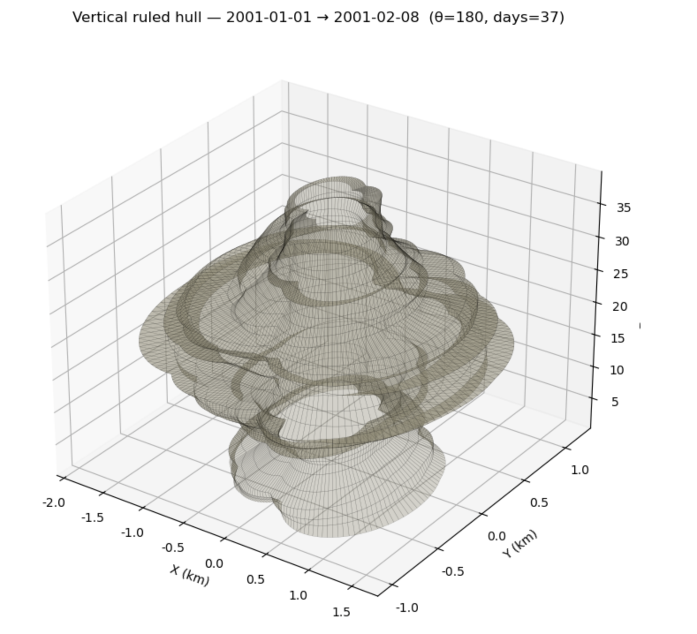
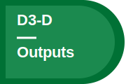

# Fire Polygon Velocity Project


We often talk about how fast a wildfire moves. But once a fire is seen from space as a changing polygon rather than a line of flame, speed stops being a single, obvious thing.

A perimeter can push forward in one direction, expand everywhere at once, wrinkle and branch, or even rearrange internally without gaining much new area. Each of these changes is real. Each can be measured. And each can yield a different answer to the same question: how fast did the fire move?

This example project takes that ambiguity seriously. It develops a practical way to think about, and measure, fire polygon velocity by comparing several definitions on the same evolving fire. The aim is not to declare a single correct metric, but to show what each measure captures, what it leaves out, and how the choice of metric shapes the story we tell about fire.

!!! note "Template instructions"
    Template instructions are on by default so workshop instructions are visible. Use the **Instructions on/off** toggle in the sidebar to preview a cleaner public-facing version.

    Replace the example fire-spread narrative with your group’s actual purpose statement. Keep the first public paragraph to 1–2 sentences that say what your group is trying to understand, why it matters, and what evidence or product you want to share.

## How to use this page
This page is your group’s working project record. The visible narrative should read like a public project page; the instruction boxes tell editors what to replace during the summit.

The task stickers are landmarks. They help you match each day-by-day direction to the place on this page where that work belongs. The same sticker appears in the instructions and on the matching front-page section.

- **People** — who is in the group and what each person brings
- **Project Question** — what your group decided to explore
- **Specialty Tracks and Strategy** — how your group is using the summit trainings
- **Data Exploration** — datasets, maps, plots, and first observations
- **Methods and Code** — workflows, notebooks, scripts, and reproducible steps
- **Results** — patterns, findings, and interpretations
- **Polished Outputs** — final figures, PDFs, slides, or other shareable products

!!! note "How to edit this section"
    Keep this orientation short. It should help editors understand the page without becoming part of the project’s final public story.

    When instructions are off, these notes are hidden so readers see the project narrative, figures, people, outputs, and references.

## People { #people }

<span id="edit-D1-A"></span>
[{ .task-sticker }](instructions/day1.md#guide-D1-A)
<span id="edit-D1-C"></span>
[{ .task-sticker }](instructions/day1.md#guide-D1-C)

This project is meant to be shaped by the people in the room: their field experience, data skills, modeling instincts, design sense, and curiosity about how spatial fire records become scientific claims.

!!! note "D1-A / D1-C: How to edit the people gallery"
    Replace the example people below with the people in your group. Each person edits their own Markdown profile file, and the homepage reads from those files.

    To update the gallery, edit `docs/_data/people.yml`. Keep that file as a short index only:

    ```yaml
    people:
      - profile: people/your-file-name.md
    ```

    Do not duplicate profile text in YAML. Copy learner files from the Innovation Summit learner folder into `docs/people/`, then add one `profile:` line per group member.

    [Find learner files in the Innovation Summit 2026 repository](https://github.com/CU-ESIIL/Innovation-Summit-2026/tree/main/docs/learners)

    Profile images are optional. A GitHub username in the profile front matter shows the GitHub avatar; otherwise the card shows initials.

{{ people_gallery }}

## Project Question { #project-question }

<span id="edit-D1-B"></span>
[{ .task-sticker }](instructions/day1.md#guide-D1-B)
<span id="edit-D2-A"></span>
[{ .task-sticker }](instructions/day2.md#guide-D2-A)
<span id="edit-D3-A"></span>
[{ .task-sticker }](instructions/day3.md#guide-D3-A)

How should we measure the velocity of an evolving fire polygon, and how does the choice of metric change the story we tell about fire spread?

In fire behavior science, rate of spread has a clear meaning: how quickly a flame front advances through fuel under given conditions [@finney1998]. That concept underpins both models and operational thinking.

Satellite-era fire records are different. They often arrive as daily or near-daily outlines of burned area derived from products such as MODIS, VIIRS, Landsat, MTBS, or related fire-perimeter datasets. Those outlines are not simple lines moving forward. They are shapes that grow, stretch, fold, and sometimes reorganize.

The translation from local spread to polygon change is therefore not straightforward. If a perimeter extends eastward, gains area, develops fine-scale structure, and shifts its center of mass, which of those changes counts as velocity? Different definitions answer that question in different ways.

The gap this project addresses is quiet but important: the same fire can appear fast or slow, stable or erratic, depending on how velocity is defined. Without a clear taxonomy, these differences can be mistaken for disagreement rather than recognized as different views of the same evolving system.

!!! note "D1-B / D2-A / D3-A: How to edit the project question"
    Replace this section with your group’s project question. It is okay if the question changes during the summit.

    Helpful prompts:

    - What are we trying to understand?
    - Why does this question matter?
    - What would count as a useful answer by Day 3?
    - What are we still unsure about?


*This whiteboard captures the first version of the polygon-velocity question: define what counts as movement, compare several velocity metrics, and keep metric choice visible as part of the interpretation.*

!!! note "How to replace the whiteboard image"
    Upload a new whiteboard or notes photo to `docs/assets/whiteboards/`, update the image path above, and rewrite the caption so it says what decision the image supports.

## Specialty Tracks and Strategy { #specialty-tracks-and-strategy }

<span id="edit-D1-D"></span>
[{ .task-sticker }](instructions/day1.md#guide-D1-D)
<span id="edit-D2-B"></span>
[{ .task-sticker }](instructions/day2.md#guide-D2-B)
<span id="edit-D2-C"></span>
[{ .task-sticker }](instructions/day2.md#guide-D2-C)

The example group uses the summit tracks as a division of labor. One subgroup focuses on geospatial workflows for comparing evolving polygons. Another uses AI-assisted synthesis to organize fire-behavior concepts, metric definitions, and interpretation notes. A third focuses on visualization and communication: how to show that different velocity metrics are not competing answers, but different lenses on polygon change.

The shared strategy is to keep the fire sequence constant and change only the definition of velocity. That makes the differences among metrics visible and interpretable before introducing the additional complexity of observational data.

!!! note "D1-D / D2-B / D2-C: How to edit specialty track strategy"
    Replace this section with notes about how your group is using the summit specialty tracks.

    Capture:

    - which tracks people attended or plan to attend
    - what each person brought back from a track
    - how the training changed your project strategy
    - what skills your group still needs

## Data Exploration { #data-exploration }

<span id="edit-D1-E"></span>
[{ .task-sticker }](instructions/day1.md#guide-D1-E)
<span id="edit-D2-E"></span>
[{ .task-sticker }](instructions/day2.md#guide-D2-E)
<span id="edit-D3-C"></span>
[{ .task-sticker }](instructions/day3.md#guide-D3-C)

The first data pass uses a ten-day synthetic fire sequence designed to be realistic but readable. The sequence grows directionally, develops irregular structure, and exhibits branching behavior. Starting with a controlled example allows the group to isolate geometric effects before moving to noisier satellite-derived perimeter products.

Useful data products for this example include daily perimeter polygons, derived boundary samples, area-change summaries, centroid positions, and distance-based comparisons between successive perimeters. In a real-data extension, the same workflow could be applied to MTBS, MODIS, VIIRS, Landsat, or related fire perimeter products.

!!! note "D1-E / D2-E / D3-C: How to edit data exploration"
    Replace this section with the datasets, maps, plots, screenshots, tables, or first observations your group is using to understand the question.

    Strong data notes say what the dataset contains, why it matters, and what remains uncertain.


*This early exploration checks how much the apparent velocity changes when the same evolving polygon is summarized by different geometric measurements.*

!!! note "How to replace the exploration figure"
    Upload rough plots, screenshots, maps, or GIFs to `docs/assets/explorations/`. Rewrite the caption so it says what the figure shows, what surprised you, and what still does not make sense.

[Open the ESIIL Data Library](https://cu-esiil.github.io/data-library/innovation-summit-2025/){ .md-button }
[Document your group data notes](data.md){ .md-button }

## Methods and Code { #methods-and-code }

<span id="edit-D1-F"></span>
[{ .task-sticker }](instructions/day1.md#guide-D1-F)
<span id="edit-D2-D"></span>
[{ .task-sticker }](instructions/day2.md#guide-D2-D)

The example workflow keeps the analysis intentionally small and inspectable: load the synthetic perimeter sequence, calculate seven velocity metrics for each time step, group those metrics by what they emphasize, and export figures that can be checked by someone outside the group.

The seven definitions are organized into functional groups:

- **Core baselines:** optimal transport and area gain per perimeter length.
- **Diagnostic surge detectors:** longest vector and P95 advance.
- **Conservative proxies:** mean advance and equivalent radius growth.
- **Niche translation measure:** centroid drift.

These categories are heuristic rather than exhaustive. Their purpose is to clarify how different definitions emphasize different aspects of change: growth, translation, deformation, rare advances, or stable summary behavior.

!!! note "D1-F / D2-D: How to edit methods and code"
    Replace this section with the tools, notebooks, scripts, workflows, or repeatable steps your group tried.

    Include:

    - what you tried
    - what worked
    - what did not work
    - where the code or notebook lives
    - what someone else would need to reproduce or extend the work

[View shared code](https://github.com/CU-ESIIL/Project_group_OASIS/tree/main/code){ .md-button }

## Results { #results }

<span id="edit-D2-F"></span>
[{ .task-sticker }](instructions/day2.md#guide-D2-F)
<span id="edit-D3-B"></span>
[{ .task-sticker }](instructions/day3.md#guide-D3-B)
<span id="edit-D3-E"></span>
[{ .task-sticker }](instructions/day3.md#guide-D3-E)

The central result is that polygon-derived velocity is not a single objective quantity. It depends on how change is defined and measured.

Three claims are worth carrying into a public share-out:

- **Velocity depends on definition.** Across the synthetic sequence, all metrics detect growth, but they diverge in magnitude and interpretation. Some emphasize rare, rapid advances; others describe steady expansion; others capture whole-system rearrangement.
- **Growth and reorganization are different signals.** Area gain per perimeter length reports velocity only when new area is added. Optimal transport, under the cost formulation used here, measures the displacement needed to transform one polygon into the next. That means a fire can show little new area gain while still undergoing substantial internal reorganization.
- **Extreme metrics are informative but selective.** The longest-vector metric highlights the single largest advance between perimeters, making it sensitive to rare leaps such as spotting or branching runs. P95 advance offers a more stable upper-tail version. These measures are useful for head-fire or surge questions, but less appropriate for typical spread.
- **Stable summaries can hide structure.** Mean advance and equivalent radius growth produce smooth, comparable time series. That stability is useful, but it can obscure anisotropy, directional runs, and boundary complexity. Centroid drift captures net migration, but misses expansion that occurs without large translation.

The same fire can support multiple, internally consistent descriptions of its motion. That does not indicate a flaw in the metrics. It reflects the fact that each definition is a lens on a complex, evolving shape. Metric choice is therefore not just a technical detail; it shapes the scientific claim.

!!! note "D2-F / D3-B / D3-E: How to edit results"
    Replace this section with emerging results, patterns, findings, surprises, or honest limits. A strong result makes a claim, points to evidence, and names uncertainty.

    Useful result statements can sound like:

    - We are starting to see...
    - One pattern that surprised us was...
    - This result is still uncertain because...
    - The data do not yet support...


*This supports the main result by showing how an evolving fire perimeter can produce different velocity interpretations depending on which geometric change is measured.*


*These panels compare alternate summaries of the same polygon sequence, showing how stable metrics, tail metrics, and translation metrics emphasize different parts of the story.*

!!! note "How to replace result figures"
    Upload final or near-final figures to `docs/assets/figures/`. Captions should say which claim each figure supports and what caveat a reader should remember.

## Polished Outputs { #polished-outputs }

<span id="edit-D2-G"></span>
[{ .task-sticker }](instructions/day2.md#guide-D2-G)
<span id="edit-D3-D"></span>
[{ .task-sticker }](instructions/day3.md#guide-D3-D)
<span id="edit-D3-F"></span>
[{ .task-sticker }](instructions/day3.md#guide-D3-F)

The most reusable output from this example is a practical taxonomy and decision framework for fire polygon velocity.

Specifically, the project provides:

- A side-by-side comparison of seven velocity metrics.
- A controlled synthetic sequence for interpreting metric behavior.
- A functional grouping of metrics by what they measure.
- Guidance for selecting metrics based on the question at hand.

The work is intentionally focused on method and interpretation. The synthetic sequence isolates geometry, but real satellite-derived perimeters introduce additional complexities: pixel stair-steps, temporal compositing, truncated narrow runs, and sensor-specific biases. These factors can inflate or dampen distance-based measures. The framework does not remove those uncertainties; it makes them visible.

Next steps are to carry the framework into real data and models:

- Apply the taxonomy to MTBS, MODIS, VIIRS, Landsat, and related products.
- Evaluate how resolution and smoothing affect each metric.
- Compare observed polygon velocities with model outputs.
- Develop tools that help users select metrics for specific purposes.
- Extend the framework toward a moment-based synthesis separating growth, translation, dilation, and deformation.

!!! note "D2-G / D3-D / D3-F: How to edit polished outputs"
    Replace this section with the final things you want people to find after the summit: polished figures, a PDF, slides, a notebook, a data product, or a short handoff note.


*This public-facing figure summarizes the workflow from evolving perimeter observations to a cautious, metric-aware interpretation of fire polygon velocity.*

[Read the project brief PDF](assets/files/project_brief.pdf){ .md-button .md-button--primary }
[Compare computing costs](https://what-uses-more.com){ .md-button }

## Cite & Reuse

This example page cites the reusable OASIS template [@oasisProjectTemplate] and a classic fire spread modeling reference [@finney1998]. A completed group page should also cite the fire perimeter products, software, notebooks, and project outputs used to support its claims.

License: MIT unless noted. See dataset licenses on the **[Data](data.md)** page.

!!! note "How to edit citations and site health"
    Add sources to `docs/references.bib`, then cite them with citation keys such as `[@oasisProjectTemplate]`.

    Keep the generated Site Health report visible in Edit Mode while preparing the page:

    --8<-- "_site_health.md"

{{ references }}
