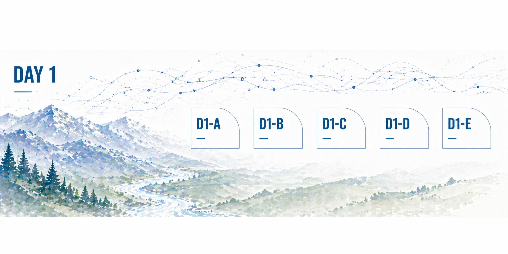
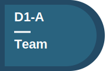
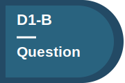
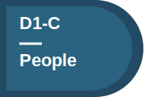
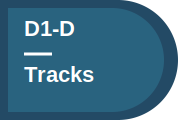
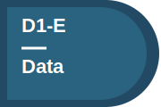
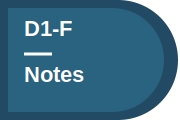

# Day 1 — Meet Your Team and Define Your Project



## What today is about
Today is about **becoming a team and choosing a direction**.
Before you write much, you should:

- meet each other
- understand what people care about
- decide what question you want to explore together

By the end of the day, your page should show:

- who you are
- what you chose to work on
- your first interaction with data

---
## A — Meet your team before editing anything
{ .task-sticker }

**Landmark:** People

**Where this shows up on the main page:** [People](../index.md#people)

Go around and introduce yourselves.

Share:

- what you work on
- what you are curious about
- what you hope to get out of the summit

This project works best when it reflects the people in the group. The question you choose should come out of this conversation.

---
## B — Choose your project and name it
{ .task-sticker }

**Landmark:** Project Question

**Where this shows up on the main page:** [Project Question](../index.md#project-question)

Agree on a scientific question or direction.
Then choose a short, descriptive project title and update the title at the top of the project page.
A good title should be clear, specific, and meaningful. It does not need to be perfect yet.

Helpful prompts:

- What are we trying to understand?
- What makes this question interesting?
- What kind of answer would feel useful or satisfying?

---
## C — Add your team to the page
{ .task-sticker }

**Landmark:** People

**Where this shows up on the main page:** [People](../index.md#people)

Each person should add one Markdown list item that links to their existing learner file in the Innovation Summit 2026 repository.

Use this format:

```markdown
- [Your Name](https://github.com/CU-ESIIL/Innovation-Summit-2026/blob/main/docs/learners/your-file-name.md)
```

If you do not know your file name, open the learner folder and search for your name:

[Innovation Summit learner files](https://github.com/CU-ESIIL/Innovation-Summit-2026/tree/main/docs/learners)

Keep the People section short, but human. Make sure the linked profile says:

- what you work on
- what you are excited about in this project
- one detail that helps others connect with you

This turns your group from a list of names into a team. It also helps others understand the perspectives behind the work.

---
## D — Talk about the specialty tracks
{ .task-sticker }

**Landmark:** Specialty Tracks and Strategy

**Where this shows up on the main page:** [Specialty Tracks and Strategy](../index.md#specialty-tracks-and-strategy)

Briefly discuss the available specialty tracks as a group.
Talk about:

- which tracks people are interested in
- whether your project might benefit from certain skills
- whether you want to split up, stay together, or decide individually tomorrow

You do not need to make a final decision yet.
Helpful prompt:

- Is there anything about your question that suggests certain skills might be especially useful?

Tomorrow, you’ll choose a specialty training. Having this conversation now helps you make a more intentional choice as a group.

---
## E — Take a first look at the data
{ .task-sticker }

**Landmark:** Data Exploration

**Where this shows up on the main page:** [Data Exploration](../index.md#data-exploration)

Look at relevant datasets and make a simple plot, map, table, or summary.
Add notes about what you see.
Include rough outputs if needed. This does not need to be polished.

Helpful prompts:

- What did you expect to see?
- What did you actually see?
- What does not make sense yet?

This is where your idea meets reality. Early observations often reshape the question itself.

---
## F — Capture what you tried and what comes next
{ .task-sticker }

**Landmark:** Methods and Code

**Where this shows up on the main page:** [Methods and Code](../index.md#methods-and-code)

Write down what you did today.

Include:

- tools, workflows, or code you used
- what worked
- what did not work
- what you want to try tomorrow

It is okay if this is incomplete or uncertain. This is just your current thinking.
You will forget details quickly. Capturing them now makes your work easier to continue tomorrow.

---
## What a strong Day 1 page looks like
By the end of Day 1, your project page should have:

- a clear project title, even if it is still rough
- everyone represented in the People section
- a first version of the project question
- at least one real interaction with data
- notes about what you tried
- early awareness of how specialty tracks might support the work
