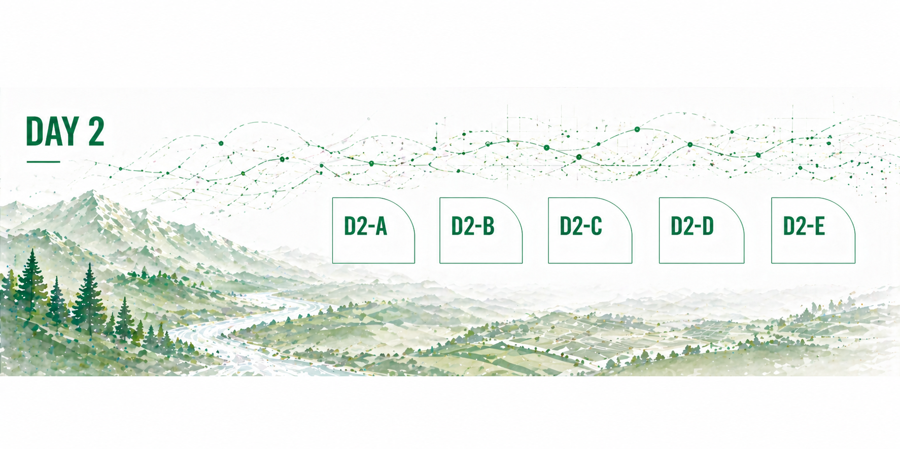
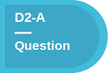
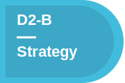
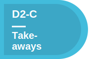
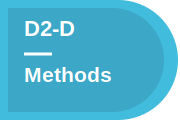
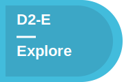
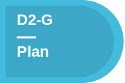

# Day 2 — Build, Explore, and Apply New Skills

## What today is about
Today is about **going deeper**.
You now have:

- a team
- a project direction
- a first look at the data
- an initial sense of which specialty skills might help

Today, you will use the specialty tracks to strengthen the project. Some groups may split up across tracks. Some groups may decide to focus together on one track. Some people may choose individually. Any of those choices can work if the group talks about it.
By the end of the day, your page should show:

- clearer methods
- deeper data exploration
- at least one emerging result, pattern, or problem
- how your thinking changed after learning something new

---
## A — Reconnect with your question

[{ .task-sticker }](../index.md#edit-D2-A)

**Landmark:** Project Question

**Where this shows up on the main page:** [Project Question](../index.md#project-question)

Start by rereading your question and yesterday’s notes.

Ask:

- Does the question still make sense?
- Did yesterday’s data exploration change what we care about?
- Do we need to narrow, sharpen, or redirect the question?

Update the Project Question section if needed.
Your question is allowed to evolve. That is part of the work.

---
## B — Choose how to use the specialty tracks

[{ .task-sticker }](../index.md#edit-D2-B)

**Landmark:** Specialty Tracks and Strategy

**Where this shows up on the main page:** [Specialty Tracks and Strategy](../index.md#specialty-tracks-and-strategy)

Before the training session, decide how your group wants to use the specialty tracks.

Options include:

- everyone chooses the track that interests them most
- the group splits up to cover multiple skills
- the group focuses on one shared track that seems most useful for the project

Add a short note to the Specialty Tracks and Strategy section explaining what you decided and why.
This does not need to be permanent. It is a working strategy.

---
## C — Attend a specialty training and bring something back

[{ .task-sticker }](../index.md#edit-D2-C)

**Landmark:** Specialty Tracks and Strategy

**Where this shows up on the main page:** [Specialty Tracks and Strategy](../index.md#specialty-tracks-and-strategy)

During or after the training, each person should capture one or two useful takeaways.

Write down:

- what you learned
- what might apply to your project
- what you want to try with the group

After the training, regroup and share what each person learned.
The goal is not just to attend a session. The goal is to bring new capability back into the project.

---
## D — Apply what you learned

[{ .task-sticker }](../index.md#edit-D2-D)

**Landmark:** Methods and Code

**Where this shows up on the main page:** [Methods and Code](../index.md#methods-and-code)

Try something new based on the specialty training.

This might mean:

- updating your workflow
- trying a new analysis
- using a new visualization
- improving a notebook or script
- changing how you organize the data

Document what changed in the Methods and Code section.
Learning matters most when it changes what you do.

---
## E — Push the data exploration further

[{ .task-sticker }](../index.md#edit-D2-E)

**Landmark:** Data Exploration

**Where this shows up on the main page:** [Data Exploration](../index.md#data-exploration)

Go beyond your first look at the data.
Try to create at least one clearer plot, map, table, or summary that helps answer your question.

Helpful prompts:

- What pattern are we looking for?
- What comparison would help?
- What variable, place, time period, or group matters most?
- What would make this figure easier for someone else to understand?

Add updated figures or notes to the Data Exploration section.

---
## F — Start forming results

[{ .task-sticker }](../index.md#edit-D2-F)

**Landmark:** Results

**Where this shows up on the main page:** [Results](../index.md#results)

Add early findings, patterns, surprises, or problems.
You do not need a final answer yet.
Useful result statements can sound like:

- “We are starting to see...”
- “One pattern that surprised us was...”
- “This result is still uncertain because...”
- “The data do not yet support...”

This is where exploration starts becoming explanation.

---
## G — Set up Day 3

[{ .task-sticker }](../index.md#edit-D2-G)

**Landmark:** Polished Outputs

**Where this shows up on the main page:** [Polished Outputs](../index.md#polished-outputs)

Before you leave for the day, decide what you want to finish tomorrow.
Add a short note somewhere useful on the page that says:

- what seems strongest so far
- what still needs cleanup
- what figure, result, or output you want to present

Day 3 will move quickly. A short plan now will make tomorrow easier.

---
## What a strong Day 2 page looks like
By the end of Day 2, your project page should have:

- an updated or reaffirmed question
- a note about how the group used the specialty tracks
- evidence that new skills changed the work
- clearer data exploration
- at least one emerging result or pattern
- a short plan for what to polish on Day 3
