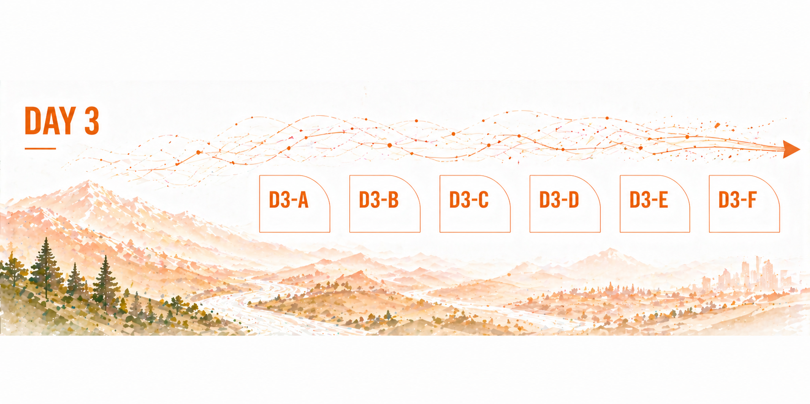

# Day 3 — Synthesize, Polish, and Share

## What today is about

Today is about turning your work into something others can understand and use. Keep polishing the [Home page](../index.md). Use the [Example page](../example.md) only as a completed model.

By the end of the day, the Home page should tell a coherent story: why the question matters, what you tried, what you found, what you made, and what should happen next.

[Edit the Day 3 section](https://github.com/CU-ESIIL/Project_group_OASIS/edit/main/docs/index.md){ .md-button .md-button--primary }

## Summit Report Out workflow

Your group page is both your workspace and your final report-out page. During the summit, use the edit buttons to update the sections for each day. On Day 3, use the **Summit Report Out** button to view the page in a clean Summit Report Out layout.

For the final report out, focus on:

- What question or challenge your group worked on
- What you built, tested, mapped, wrote, or designed
- What changed in your thinking
- What someone else could do next
- Images that make the work easier to understand

## Revisit the whole story

Read the Home page from top to bottom.

Ask:

- Does the title match the project?
- Does the question match what we actually explored?
- Can someone outside the group understand why this matters?
- Does each section support the final report out?

Update [Project Question](../index.md#project-question), [Data Exploration](../index.md#data-exploration), and [Methods and Code](../index.md#methods-and-code) so the story matches the work you actually did.

## Finalize the results

Use [Results](../index.md#results) to make a clear claim and point to evidence.

Add or revise:

- key findings
- important figures, maps, or tables
- short interpretations
- uncertainty, limits, or open questions

A strong result does not need to be a perfect answer. It needs to be honest and understandable.

## Add polished outputs

Use [Polished Outputs](../index.md#polished-outputs) to link the final things people should find after the summit.

These might include:

- a final figure
- a notebook
- a PDF or brief
- a repository link
- a dataset or data-access note
- a short handoff note

Check that links work before the final report out.

## Final Report Out (6 minutes)

Focus: synthesis and clarity.

Use your homepage as the Summit Report Out. Do not create separate slides. Add the final report-out structure to [Final Report Out (Day 3)](../index.md#report-out-day3).

Tell a coherent story:

Why -> Question -> Data/Methods -> Findings -> Next

### Team Photo

Add a team photo to your homepage.

### Findings at a glance

Write 2–3 short headlines:

- Headline 1 — what, where, how much
- Headline 2 — change, trend, or contrast
- Headline 3 — implication for practice or policy

Good headlines are specific and quantitative when possible.

### Visuals that tell the story

Select 2–3 visuals only.

Each visual should:

- support one claim
- be readable quickly
- be referenced in your narrative

### What's next?

Write 2–3 short bullets:

- immediate follow-ups
- what you would do with one more week or month
- who should see this next

### Practice guidance

Practice a six-minute walkthrough of your homepage.

Time breakdown:

- 1 minute: Why and question
- 2 minutes: Data and methods
- 2 minutes: Findings with visuals
- 1 minute: Next steps

Keep text crisp and speak to the visuals.

## End-of-day check

Before the final share-out, make sure the Home page has:

- a clear question
- readable team information
- understandable data and methods
- clean results or honest early findings
- working links to outputs
- a six-minute final report out
- a short sense of what should happen next
