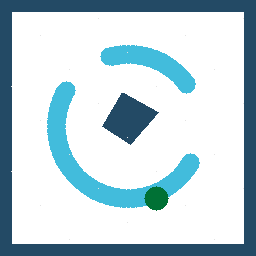
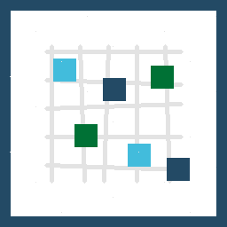
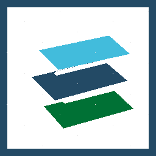

# Day 3 — Synthesize, Polish, and Share
## What today is about
Today is about **turning your work into something others can understand and use**.
You are not trying to make the project perfect. You are trying to make the project clear.
By the end of the day, your page should tell a coherent story:

- who you are
- what question you explored
- what data and methods you used
- what you found
- what you made
- what someone else could do next

---
## A — Revisit the whole story
{ .task-sticker }

**Landmark:** Project Question

**Where this shows up on the main page:** [Project Question](../index.md#project-question)

Read the page from top to bottom.

Ask:

- Does the title still match the project?
- Does the question match what we actually explored?
- Can someone outside the group understand why this matters?

Update the title or Project Question section if needed.
The story should match the work you actually did, not the plan you started with.

---
## B — Finalize the results
{ .task-sticker }

**Landmark:** Results

**Where this shows up on the main page:** [Results](../index.md#results)

Clean up the Results section.

Add or revise:

- key findings
- important figures, maps, or tables
- short interpretations
- uncertainty, limits, or open questions

Helpful prompts:

- What is the main thing we learned?
- What evidence supports it?
- What are we still unsure about?

A strong result does not need to be a perfect answer. It needs to be honest and understandable.

---
## C — Clean the data and methods sections
{ .task-sticker }
{ .task-sticker }

**Landmark:** Data Exploration and Methods and Code

**Where this shows up on the main page:** [Data Exploration](../index.md#data-exploration) and [Methods and Code](../index.md#methods-and-code)

Make the Data Exploration and Methods and Code sections readable for someone who was not in the room.

For data, make sure readers can tell:

- what datasets you used
- why those datasets were useful
- what plots, maps, or summaries show

For methods, make sure readers can tell:

- what tools or workflows you used
- where the code lives
- what someone would need to reproduce or extend the work

Remove clutter if it makes the story harder to follow.
Clarity matters more than completeness.

---
## D — Add polished outputs
{ .task-sticker }

**Landmark:** Polished Outputs

**Where this shows up on the main page:** [Polished Outputs](../index.md#polished-outputs)

Add or link the final things you want people to see.
These might include:

- a PDF
- slides
- final figures
- a notebook
- a repository link
- a dataset or data-access note

Check that links work.
This section is where someone goes after the summit to find the most useful takeaways.

---
## E — Prepare to present from the page
{ .task-sticker }
{ .task-sticker }

**Landmark:** Results and Polished Outputs

**Where this shows up on the main page:** [Results](../index.md#results) and [Polished Outputs](../index.md#polished-outputs)

Use the page as your presentation guide.

Decide:

- who will introduce the project
- which figure or result matters most
- what you want the audience to remember
- what you would do next with more time

Your page does not need to include every detail. It should help you tell the story clearly.

---
## F — Leave the project useful for others
{ .task-sticker }

**Landmark:** Polished Outputs

**Where this shows up on the main page:** [Polished Outputs](../index.md#polished-outputs)

Before you finish, add a short “next steps” note.

Include:

- what worked
- what still needs work
- what someone else could pick up later

A good final page is not just a record of what happened. It is a handoff to future work.

---
## What a strong Day 3 page looks like
By the end of Day 3, your project page should have:

- a clear title and question
- readable team information
- understandable data and methods
- clean results or honest early findings
- working links to outputs
- a short sense of what should happen next
